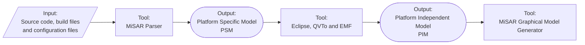

# MiSAR Parser, Transformation Engine and AIO

This repository contains the operational core of **MiSAR**: the All-in-One launcher, the source-code parser, the Platform Specific Model (PSM) generation workflow, and the resources used to transform a PSM into a Platform Independent Model (PIM). 
From the All-in-One launcher, you can access the MiSAR Graphical Model Generator. But if you would like to check its source code, (https://github.com/MicroServiceArchitectureRecovery/misar-plantUML)

The parser analyses source code artefacts from a microservice system and recovers a **Platform Specific Model (PSM)**. The transformation stage then derives a **Platform Independent Model (PIM)**, which represents the recovered architecture at a higher level of abstraction.

## Requirements

The following software is required to use the MiSAR AIO, Parser and transformation workflow:

- **Python 3.11 or later**
- **pip**, for installing the required Python dependencies
- **OpenJDK 21**
- **Eclipse**
- **QVT Operational (QVTo)**
- **Eclipse Modeling Framework (EMF)**

The AIO and Parser are executed with Python. Eclipse, QVTo, EMF and Java are required for transforming the generated Platform Specific Model into a Platform Independent Model.

For current installation and setup instructions, use the [MiSAR documentation](https://microservicearchitecturerecovery.github.io/MiSAR-Parser-and-Model-Transformation/).

## Repository Role

This repository provides:

- the **MiSAR All-in-One launcher** (`MiSAR.py`);
- the **MiSAR Parser** which provides the static analysis of the language and platform specific technologies and generates the PSM. 
-  metamodels and QVTo resources, which transform a PSM model into a PIM.
- the maintained MiSAR documentation source;
- automated tests and supporting release configuration.

## Documentation

Begin with the maintained documentation:

- **[MiSAR documentation](https://microservicearchitecturerecovery.github.io/MiSAR-Parser-and-Model-Transformation/)**
- **[Installation](https://microservicearchitecturerecovery.github.io/MiSAR-Parser-and-Model-Transformation/installation/)**
- **[Create a PSM](https://microservicearchitecturerecovery.github.io/MiSAR-Parser-and-Model-Transformation/create-psm/)**
- **[QVT installation and setup](https://microservicearchitecturerecovery.github.io/MiSAR-Parser-and-Model-Transformation/qvt-manual-installation/)**
- **[Create a PIM](https://microservicearchitecturerecovery.github.io/MiSAR-Parser-and-Model-Transformation/create-pim/)**
- **[Changelog](https://microservicearchitecturerecovery.github.io/MiSAR-Parser-and-Model-Transformation/changelog/)**

## Copyright

© 2020-2026 Dr Nour Ali, Brunel University London. All rights reserved. MiSAR is made openly available for research and evaluation purposes. The intellectual property and copyright of this tool and its associated research remain with Dr Nour Ali and Brunel University London.
