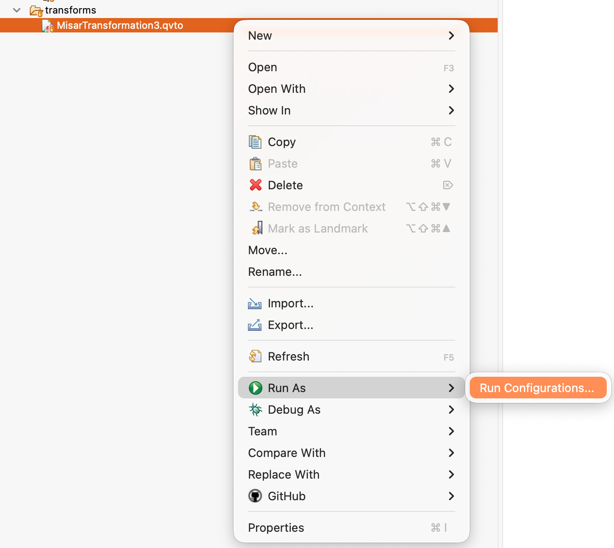
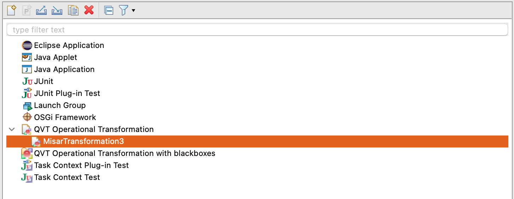
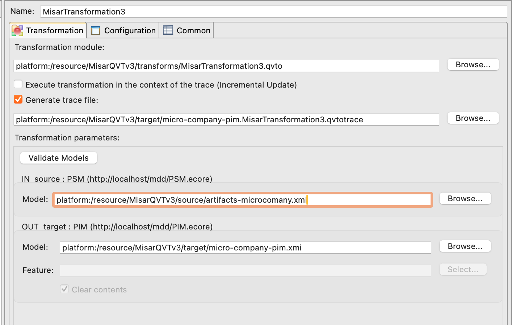
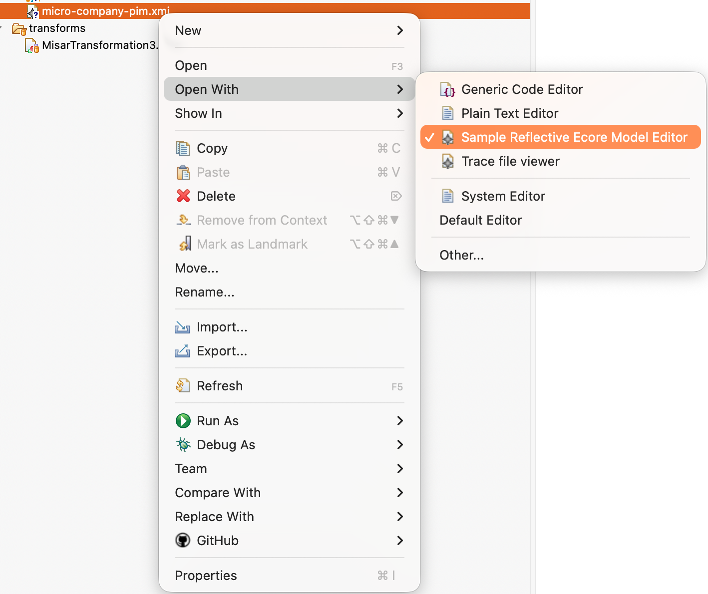
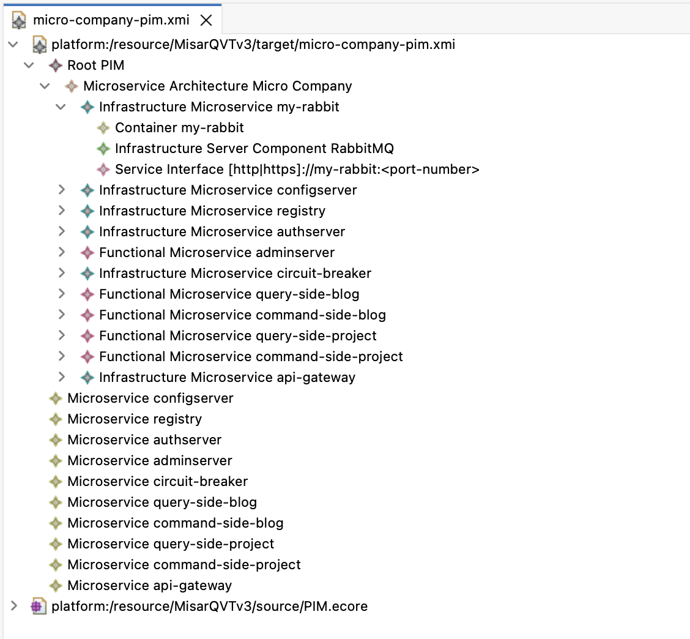

# Create PIM (Platform Independent Model)

In this part, you will learn how to transform a generated PSM instance into a PIM instance using the MiSAR QVT transformation.

### Important

Before running the transformation, ensure that the PSM file generated by the parser is imported into the Eclipse project.

You can simply copy the generated PSM file into the Eclipse project directory.

This PSM file must be selected as the **source model** during transformation.

## Open Transformation
Right click:  
MisarTransformation3.qvto → Run As → Run Configurations

{ width="600" }

## Select Transformation
Choose:  
QVT Operational Transformation

{ width="600" }

## Configure Input/Output

### Input (PSM)
Select generated PSM file (.xmi)

> NOTE: If the file is not present in the project, it will not appear in the selection list.

### Output (PIM)
Choose output location and filename

{ width="600" }

## Run Transformation
Click Run

## View Output
Right click generated file → Open With → Sample Reflective Ecore Model Editor

{ width="600" }

## Result
You will see:
- Microservices
- Functional vs Infrastructure services
- Dependencies

{ width="600" }