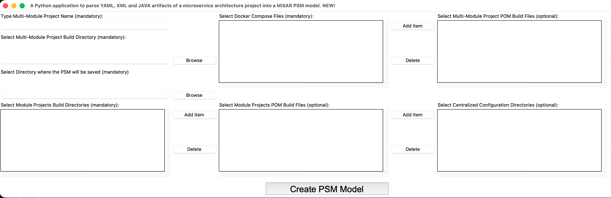
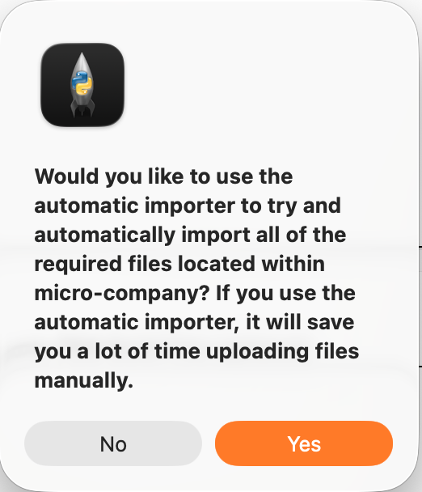
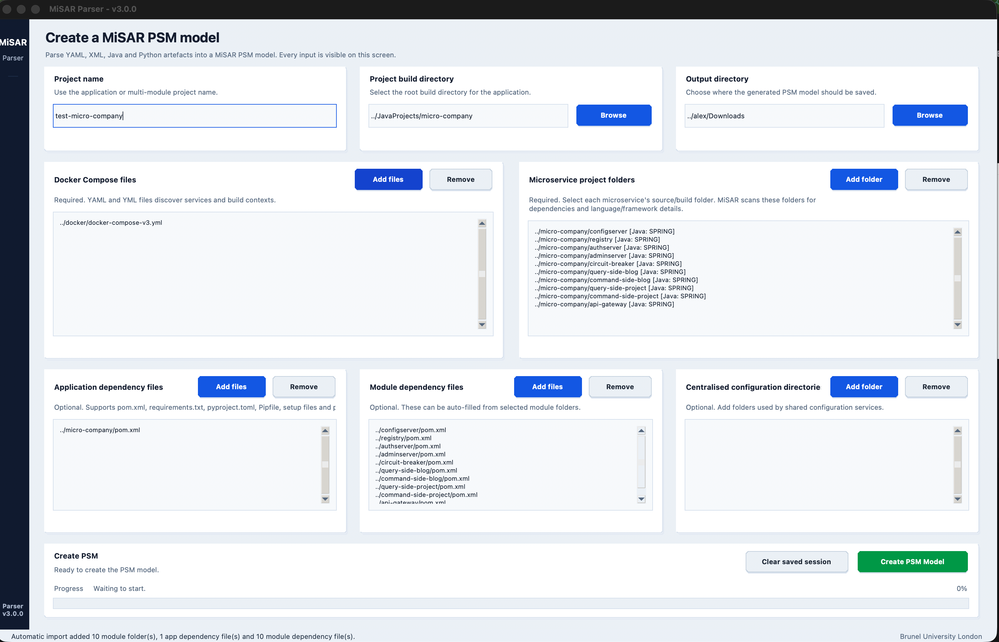
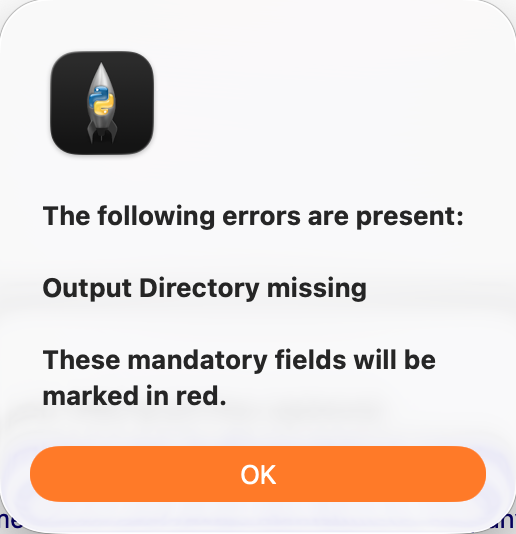
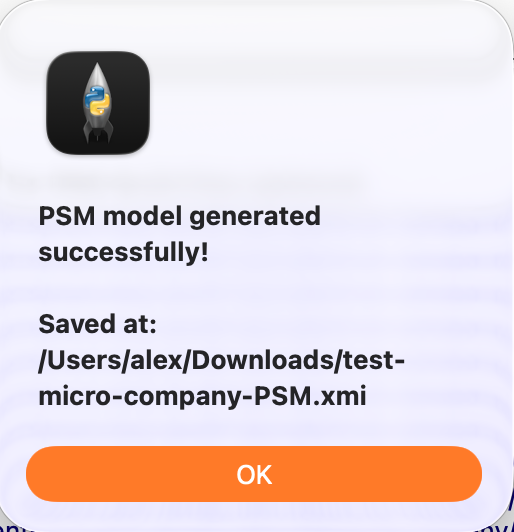

# Create PSM (Platform Specific Model)

In this part, you will learn how to use the MiSAR Parser to generate a Platform Specific Model (PSM) from an existing microservice codebase.

## Launch Parser
Run `python3 MiSAR.py` to open the MiSAR AIO interface, then click **Launch** under MiSAR Parser.

{ width="500" }

## Fill Required Fields
- Project Name
- Project Root Directory
- Output Directory (where PSM will be saved)
- Module Directories
- Docker Compose file

## Automatic Importer (For Docker Compose)
When you add a Docker Compose file, the parser can attempt to auto-populate the remaining required fields.

{ width="200" }

When prompted, click **Yes** to auto-detect project files.

## After Import
The UI will populate:
- Docker services
- Module paths
- POM files

You can manually edit/remove entries.

## Validation
If required fields are missing, an error message will appear after clicking **Create PSM Model**.  
The missing fields will also be highlighted.

{ width="200" }

## Generate PSM
Click **Create PSM Model**

## Output
If the process completes successfully, the PSM file will be generated in the selected output directory.

> Note:  
> Depending on the version, a success message may also be displayed showing the file location.

{ width="200" }