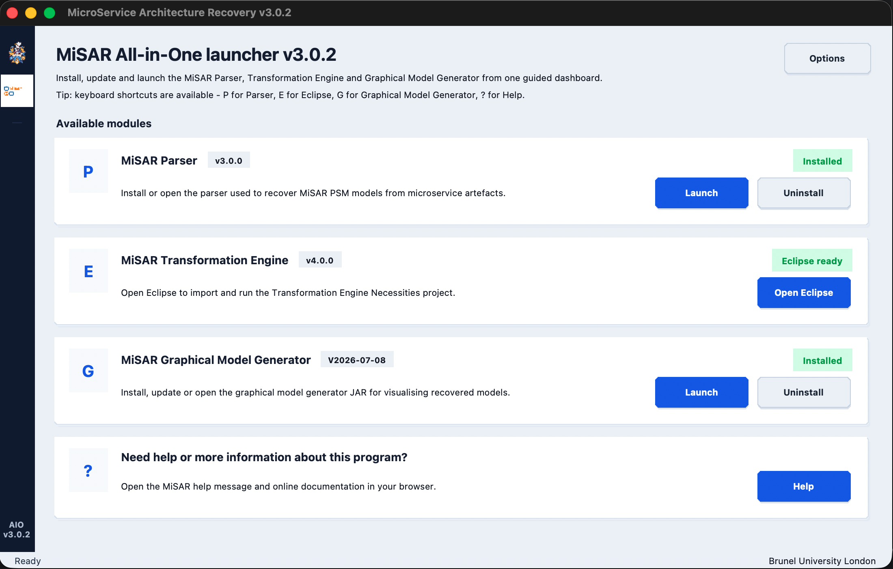
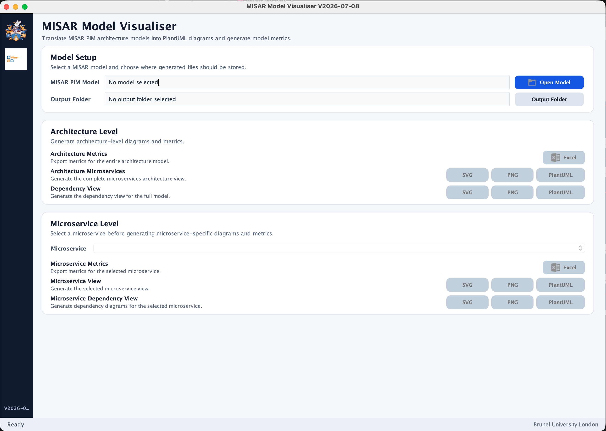
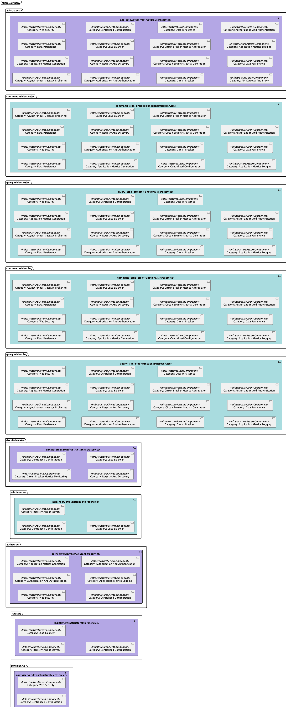
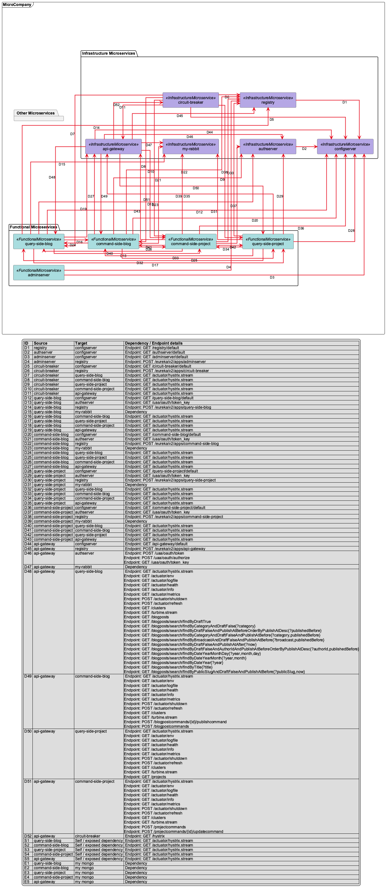
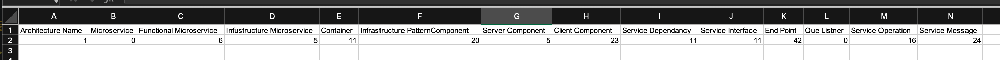

# Graphical Model Generator

The Graphical Model Generator is the final step in the MiSAR workflow. It takes the recovered PIM model and generates visual and tabular outputs that help users inspect, understand, and report the architecture of the analysed microservice system.

This step is optional, but it is useful when you want to visualise the recovered architecture after the PSM to PIM transformation has been completed.

## Overview

The Graphical Model Generator can produce:

- architecture views
- dependency views
- UML-style diagrams
- Excel summaries
- SVG diagram outputs for large architectures

These outputs help users understand the structure of the recovered system, including microservices, components, dependencies, and endpoint-level relationships.

## Launch Graphical Model Generator

Run `python3 MiSAR.py` to open MiSAR AIO, then click **Launch** under **MiSAR Graphical Model Generator**.

The Graphical Model Generator interface will then open.

## Input

Provide the PIM file generated from the transformation step.

The PIM file is the recovered architectural model created from the PSM to PIM transformation process.

You can select where the generated outputs will be saved by choosing an output directory. Default output directory is `USER_HOME/Documents`.

> USER_HOME is the home directory of the user running MiSAR.
> 
> On Windows it may be `C:\Users\USERNAME`, and on Linux and macOS it may be `/home/USERNAME`.

## Outputs

The Graphical Model Generator produces different outputs for analysing the recovered architecture.

The most common outputs are:

- Architecture View
- Dependency View
- Excel Summary
- SVG versions of diagrams

## Architecture View

The **Architecture View** shows the internal structure of the recovered microservice architecture.

It focuses on the microservices and the components identified inside them. This view is useful for understanding what each microservice contains and how MiSAR has classified the recovered architectural elements.

For example, the Architecture View may show:

- functional microservices
- infrastructure microservices
- infrastructure components
- infrastructure clients
- infrastructure servers
- component categories such as load balancer, registry and discovery, data persistence, authentication, API gateway, and circuit breaker

### When to Use the Architecture View

Use the Architecture View when you want to understand:

- which microservices were recovered
- which components exist inside each microservice
- whether a microservice is functional or infrastructure-related
- what infrastructure patterns or components are present in the system
- the overall structural organisation of the architecture

This view is especially useful for architecture analysis, reporting, and explaining the recovered system at a higher structural level.

## Dependency View

The **Dependency View** shows the dependencies between recovered microservices.

It focuses on how microservices communicate with each other, including dependency relationships and endpoint-level details where available.

The Dependency View may include:

- source microservice
- target microservice
- dependency identifiers
- dependency lines between services
- endpoint details
- self dependencies
- exposed dependencies
- database or infrastructure-related dependencies

The diagram is usually supported by a dependency table. This table provides more detailed information about each dependency shown in the diagram.

### When to Use the Dependency View

Use the Dependency View when you want to understand:

- which microservices depend on each other
- which service calls another service
- which endpoints are involved in the dependency
- whether a service has self or exposed dependencies
- how communication is distributed across the system
- whether the architecture has many cross-service relationships

This view is useful for analysing coupling, communication flow, service interaction, and dependency complexity.

## Excel Summary

The Graphical Model Generator can also produce an Excel summary of the recovered architecture.

The Excel output is useful when the generated diagrams are too large to inspect visually, or when you need exact counts and structured architectural information for analysis or reporting.

The generated Excel file contains three main sheets:

1. **Architecture Metrics**
2. **Pattern Categories**
3. **Category Summary**

### Architecture Metrics

The **Architecture Metrics** sheet provides a high-level numerical summary of the recovered architecture.

It includes counts such as:

- architecture name
- number of microservices
- number of functional microservices
- number of infrastructure microservices
- number of containers
- number of infrastructure pattern components
- number of server components
- number of client components
- number of service dependencies
- number of service interfaces
- number of endpoints
- number of queue listeners
- number of service operations
- number of service messages

Use this sheet when you want a quick overview of the size and complexity of the recovered architecture.

For example, it can help answer questions such as:

- How many microservices were recovered?
- How many dependencies exist between services?
- How many endpoints were detected?
- How many infrastructure-related components were identified?

### Pattern Categories

The **Pattern Categories** sheet lists the recovered infrastructure components and their categories for each microservice.

Each row usually includes:

| Column | Description |
|--------|-------------|
| **Microservice** | The microservice where the component was detected. |
| **Component Type** | The type of recovered component, such as infrastructure pattern, client component, or server component. |
| **Category** | The architectural or infrastructure category assigned to the component. |
| **Count** | The number of matching components detected for that microservice and category. |

This sheet is useful for understanding which infrastructure patterns or supporting components exist inside each microservice.

Examples of categories may include:

- Data Persistence
- Web Security
- Load Balancer
- Registry And Discovery
- Centralised Configuration
- Authorisation And Authentication
- Asynchronous Message Brokering
- Circuit Breaker
- Application Metrics Logging
- API Gateway And Proxy

Use this sheet when you want to inspect the internal architectural characteristics of each microservice.

### Category Summary

The **Category Summary** sheet aggregates the detected component categories across the whole architecture.

Instead of showing each microservice separately, it groups results by:

| Column             | Description                                                                              |
|--------------------|------------------------------------------------------------------------------------------|
| **Component Type** | The recovered component type.                                                            |
| **Category**       | The detected infrastructure or architectural category.                                   |
| **Total Count**    | The total number of components found for that type and category across the architecture. |

This sheet is useful when you want to understand the overall distribution of architectural patterns in the system.

For example, it can help identify:

- which infrastructure patterns appear most frequently
- how many services use centralised configuration
- how often data persistence appears
- whether registry/discovery, security, gateway, or circuit breaker patterns are present
- the overall infrastructure profile of the recovered system

### When to Use the Excel Summary

Use the Excel Summary when:

- the diagrams are too large or crowded to inspect manually
- you need exact numerical metrics
- you want to compare microservices
- you want to inspect component categories in detail
- you need structured evidence for a report
- you want to understand the overall architectural pattern distribution

A recommended approach is to use the diagrams for visual understanding, then use the Excel Summary to verify the exact details.

## Viewing Large Architecture Diagrams

When the recovered architecture is large, some generated diagrams may appear crowded or difficult to inspect in standard image formats.

For example, you may notice that:

- part of the architecture appears to be missing from the visible area
- dependency lines seem to continue outside the image
- some services, components, or labels are too small to read
- lines appear to point towards areas that are not visible
- the diagram is too compressed to understand clearly

In these cases, it is recommended to use the **SVG** version of the generated diagram.

SVG contains the same diagram content, but it is easier to zoom, expand, and inspect without losing visual quality. This makes it more suitable for broader architecture views, especially when the model contains many microservices, dependencies, or UML elements.

## Navigating the Generated Outputs

After generating the graphical outputs, review the files in the selected output directory.

A recommended navigation approach is:

1. Open the **Architecture View** first to understand the recovered microservices and their internal components.
2. Open the **Dependency View** to inspect communication and dependency relationships between services.
3. Use the **Excel Summary** to check detailed dependency and component information.
4. Use the **SVG** diagrams if the PNG or standard image output is too small, crowded, or unclear.

For large systems, it is usually easier to start with the Architecture View, then move to the Dependency View after you understand the main services and components.

## Glossary

| Term                                 | Meaning                                                                                                                                                                         |
|--------------------------------------|---------------------------------------------------------------------------------------------------------------------------------------------------------------------------------|
| **PIM**                              | Platform Independent Model. This is the recovered architectural model generated after transforming the PSM.                                                                     |
| **Architecture View**                | A graphical view showing the recovered microservices and their internal architectural components.                                                                               |
| **Dependency View**                  | A graphical view showing dependencies and communication relationships between microservices.                                                                                    |
| **Functional Microservice**          | A microservice mainly responsible for business or application functionality.                                                                                                    |
| **Infrastructure Microservice**      | A microservice mainly responsible for supporting infrastructure concerns, such as registry, gateway, authentication, or circuit breaking.                                       |
| **Infrastructure Component**         | A recovered component related to infrastructure behaviour, such as data persistence, load balancing, registry and discovery, or authentication.                                 |
| **Infrastructure Pattern Component** | A recovered component representing an architectural or infrastructure pattern detected inside a microservice.                                                                   |
| **Infrastructure Client Component**  | A component showing that a microservice uses or connects to an infrastructure capability, such as configuration, messaging, registry, or persistence.                           |
| **Infrastructure Server Component**  | A component showing that a microservice provides an infrastructure capability, such as registry, configuration, gateway, or message brokering.                                  |
| **Dependency**                       | A relationship where one microservice depends on, calls, or communicates with another service or infrastructure element.                                                        |
| **Service Dependency**               | A detected dependency relationship between services, often shown in the Dependency View and Excel metrics.                                                                      |
| **Endpoint**                         | A recovered API or service endpoint involved in a dependency relationship.                                                                                                      |
| **Self Dependency**                  | A dependency where a service exposes or refers to functionality within itself.                                                                                                  |
| **Exposed Dependency**               | A dependency exposed by a service, usually representing externally visible functionality or endpoints.                                                                          |
| **Architecture Metrics**             | An Excel sheet that provides high-level counts for the recovered architecture, such as number of microservices, dependencies, endpoints, containers, and components.            |
| **Pattern Categories**               | An Excel sheet that lists recovered component categories for each microservice. It helps show which infrastructure or architectural patterns were detected inside each service. |
| **Category Summary**                 | An Excel sheet that aggregates recovered component categories across the whole architecture, showing the total count for each component type and category.                      |
| **SVG**                              | Scalable Vector Graphics. A diagram format that can be zoomed and resized without losing quality. Useful for large architecture diagrams.                                       |
| **Excel Summary**                    | A spreadsheet output containing structured details about the recovered architecture, components, and dependencies.                                                              |

## Notes

- If you encounter issues with the generated diagrams, such as missing elements or unclear labels, try using the SVG version for better clarity.
- If you encounter errors during generation, check whether the selected PIM file is a valid PIM file. The file should have been generated from the PSM to PIM transformation step by eclipse Transformation Engine. If the file is not a valid PIM, the generator would show an error message.