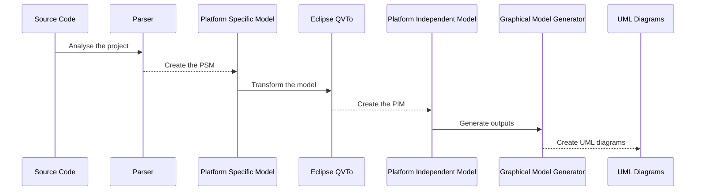

# Welcome to MiSAR

## What is MiSAR?
MiSAR is an approach that follows the Model Driven Architecture to semi-automatically generate architectural models of implemented microservice systems. 

A video demonstration of MiSAR can be found at:

[https://www.youtube.com/watch?v=sdRDkLesyS0](https://www.youtube.com/watch?v=sdRDkLesyS0)

MiSAR consists of a parser that creates a Platform Specific Model from existing systems and a Model Transformation engine that transforms platform Specifc Models into Platform Independent Model instances. An instance of a MiSAR Platform Independent Model is the recovered architectural model of the implemented microservice system. 

## Workflow Overview
1. Parse code → Generate PSM (Platform Specific Model)
2. Transform PSM → PIM (Platform Independent Model)
3. Generate UML diagrams (optional)

This diagram shows the basic MiSAR workflow: the source code is analysed by the parser, converted into a Platform Specific Model, transformed into a Platform Independent Model, and then used to generate UML diagrams.

## Prerequisites

Before using MiSAR, ensure the following tools and runtimes are installed or available on your system.

| Requirement         | Tested Version                       | Required For                                             |
|---------------------|--------------------------------------|----------------------------------------------------------|
| Python              | Python 3.11+                         | Running `MiSAR.py` and the core PSM generation process   |
| Java                | OpenJDK 21 LTS                       | Running `misar.jar` and supporting Eclipse-based tooling |
| Eclipse             | Eclipse 2024                         | Running the QVT transformation workflow from PSM to PIM  |
| QVTo                | QVTo 3.11.2                          | Transforming PSM models into PIM models                  |
| Python dependencies | Installed automatically by MiSAR AIO | Required Python modules used by the MiSAR application    |

## Sections
- [MISAR Installation](installation.md)
- [Create PSM](create-psm.md)
- [QVT Plugin Installation](qvt-manual-installation.md)
- [QVT Setup](qvt-setup.md)
- [Create PIM](create-pim.md)
- [Graphical Model Generator](graphical-generator.md)
- [Uninstallation](uninstallation.md)
- [Changelog](changelog.md)

## Next Steps
**Ready to get started?** Install MISAR by following the [installation guide](installation.md) and create your first Platform Specific Model!