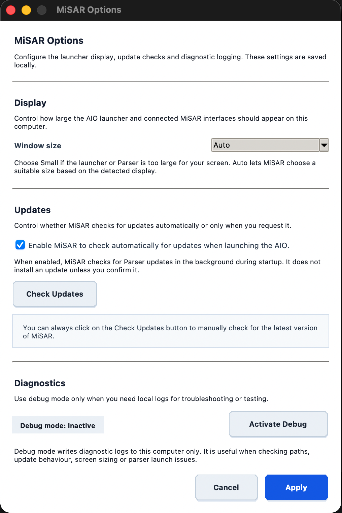

# Installation

## Download MiSAR

Before running MiSAR, you need to download the project files from the GitHub repository: [https://github.com/MicroServiceArchitectureRecovery/MiSAR-Parser-and-Model-Transformation](https://github.com/MicroServiceArchitectureRecovery/MiSAR-Parser-and-Model-Transformation).

There are two supported ways to do this:

1. Download the repository as a ZIP file
2. Clone the repository using Git

### Option 1 – Download ZIP from GitHub

This option is recommended if you do not want to use Git commands.

1. Open the MiSAR GitHub repository in your browser.
2. Click the green **Code** button.
3. Select **Download ZIP**.

{ width="400" }

4. After the download completes, extract the ZIP file.

5. Open the extracted folder.

The extracted folder contains the MiSAR project files, including the main AIO launcher file:

```text
MiSAR.py
```


### Option 2 – Clone MiSAR Using Git

This option is recommended if you are familiar with Git or want to keep the project linked to the GitHub repository.
    
1.  Open a terminal.
    
2.  Navigate to the folder where you want to store MiSAR.
    
3.  Run the following command:
    

```bash
git clone https://github.com/MicroServiceArchitectureRecovery/MiSAR-Parser-and-Model-Transformation.git
```


4. After cloning, move into the project directory:
    

```bash
cd MiSAR-Parser-and-Model-Transformation
```

## Running MiSAR (First Launch)
To launch the MiSAR All-In-One (AIO) tool:

1. Open a terminal
2. Navigate to the MiSAR project directory
3. Run:

```bash
python3 MiSAR.py
```

When running MiSAR for the first time, it will detect missing dependencies:

{ width="200" }

Click **Yes** to install them automatically.

## After Installation
A success message will confirm everything is installed correctly.

{ width="200" }


## MiSAR AIO Options

Click **Options** in the top-right corner of the MiSAR AIO launcher to configure display, update, and diagnostic settings.

{ width="500" }

### Display

Use **Window size** to control how large the AIO launcher and connected MiSAR interfaces appear.

Available choices include:

- **Auto** – MiSAR selects a suitable size based on the detected display.
- **Small** – useful when the launcher or Parser is too large for the screen.
- **Default**
- **Large**
- **Extra large**

After changing a display option, MiSAR may ask to restart so the new interface size is applied cleanly.

### Updates

The **Updates** section allows users to:

- enable or disable automatic update checks when launching the AIO
- manually check for the latest MiSAR version using **Check Updates**

MiSAR does not install an available update unless the user confirms it.

When an installed update may contain interface changes, MiSAR asks the user to restart the launcher so the updated UI is loaded.

### Diagnostics

The **Diagnostics** section contains the debug-mode control.

Debug mode writes diagnostic logs to the local computer and can help troubleshoot:

- parser launch issues
- update behaviour
- selected paths
- display sizing
- local runtime problems

Debug logs are not uploaded anywhere and remain on the local computer. They can be shared with the MiSAR development team if needed.

## Notes
- Ensure Python 3.11+ is installed
- Ensure you have an active internet connection for automatic module installation
- If you downloaded the ZIP version, make sure it has been extracted before running MiSAR.py
- If you cloned the repository using Git, run MiSAR from inside the cloned project directory

## Next Steps
Now you can start using MiSAR to create Platform Specific Models from your microservice projects! [PSM creation guide](create-psm.md)
