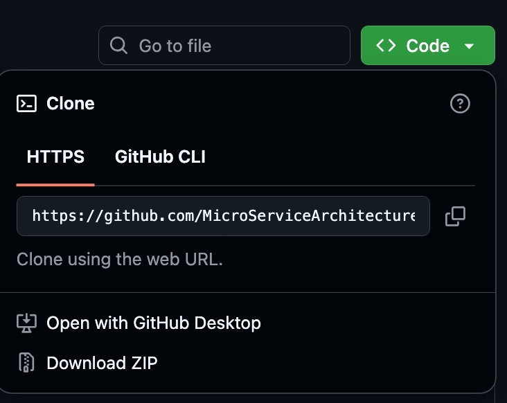
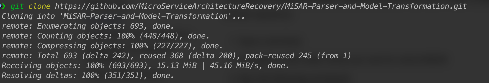
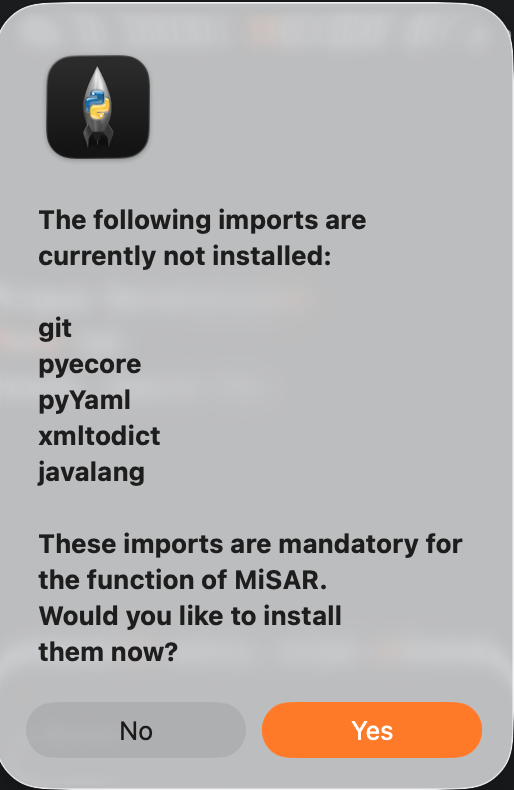
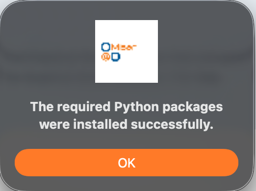

# Installation

## Download MiSAR

Before running MiSAR, you need to download the project files from the GitHub repository: [https://github.com/MicroServiceArchitectureRecovery/MiSAR-Parser-and-Model-Transformation](https://github.com/MicroServiceArchitectureRecovery/MiSAR-Parser-and-Model-Transformation).

There are two supported ways to do this:

1. Download the repository as a ZIP file
2. Clone the repository using Git

### Option 1 – Download ZIP from GitHub

This option is recommended if you do not want to use Git commands.

1. Open the MiSAR GitHub repository in your browser.
2. Click the green **Code** button.
3. Select **Download ZIP**.

{ width="400" }

4. After the download completes, extract the ZIP file.

5. Open the extracted folder.

The extracted folder contains the MiSAR project files, including the main AIO launcher file:

```text
MiSAR.py
```


### Option 2 – Clone MiSAR Using Git

This option is recommended if you are familiar with Git or want to keep the project linked to the GitHub repository.
    
1.  Open a terminal.
    
2.  Navigate to the folder where you want to store MiSAR.
    
3.  Run the following command:
    

```bash
git clone https://github.com/MicroServiceArchitectureRecovery/MiSAR-Parser-and-Model-Transformation.git
```



4. After cloning, move into the project directory:
    

```bash
cd MiSAR-Parser-and-Model-Transformation
```

## Running MiSAR (First Launch)
To launch the MiSAR All-In-One (AIO) tool:

1. Open a terminal
2. Navigate to the MiSAR project directory
3. Run:

```bash
python3 MiSAR.py
```

When running MiSAR for the first time, it will detect missing dependencies:

{ width="200" }

Click **Yes** to install them automatically.

## After Installation
A success message will confirm everything is installed correctly.

{ width="200" }

## Notes
- Ensure Python 3.11+ is installed
- Ensure you have an active internet connection for automatic module installation
- If you downloaded the ZIP version, make sure it has been extracted before running MiSAR.py
- If you cloned the repository using Git, run MiSAR from inside the cloned project directory
