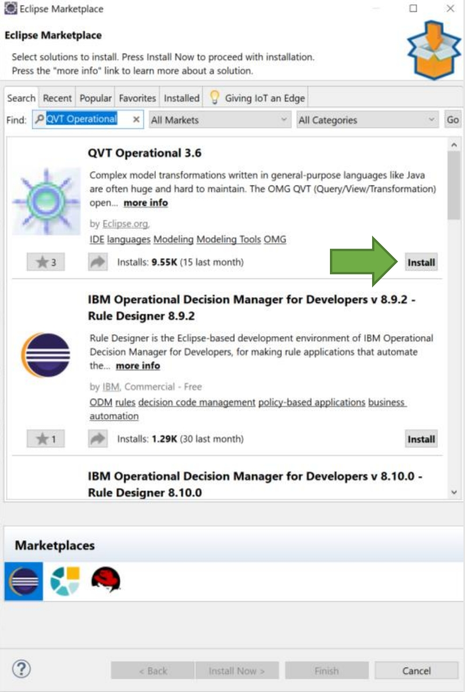
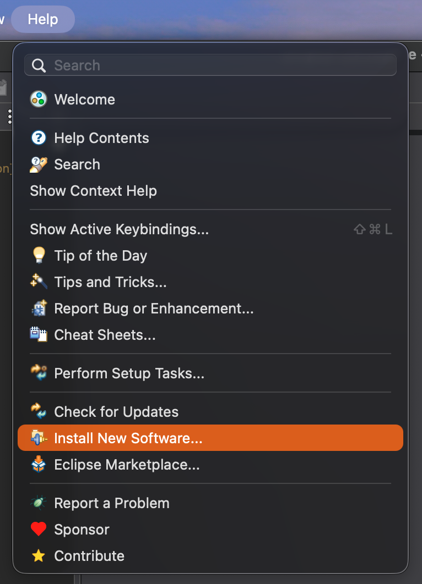
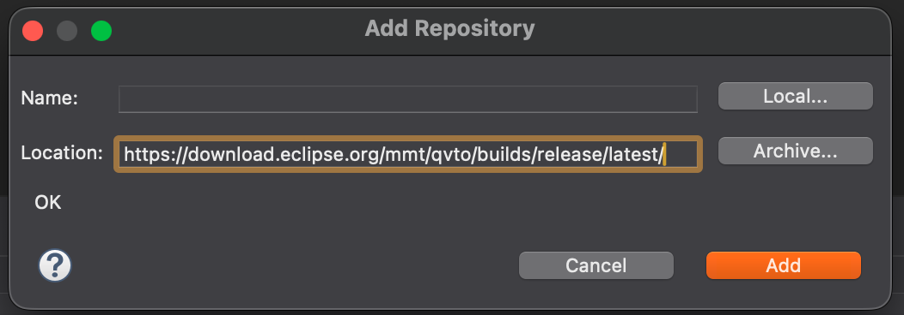
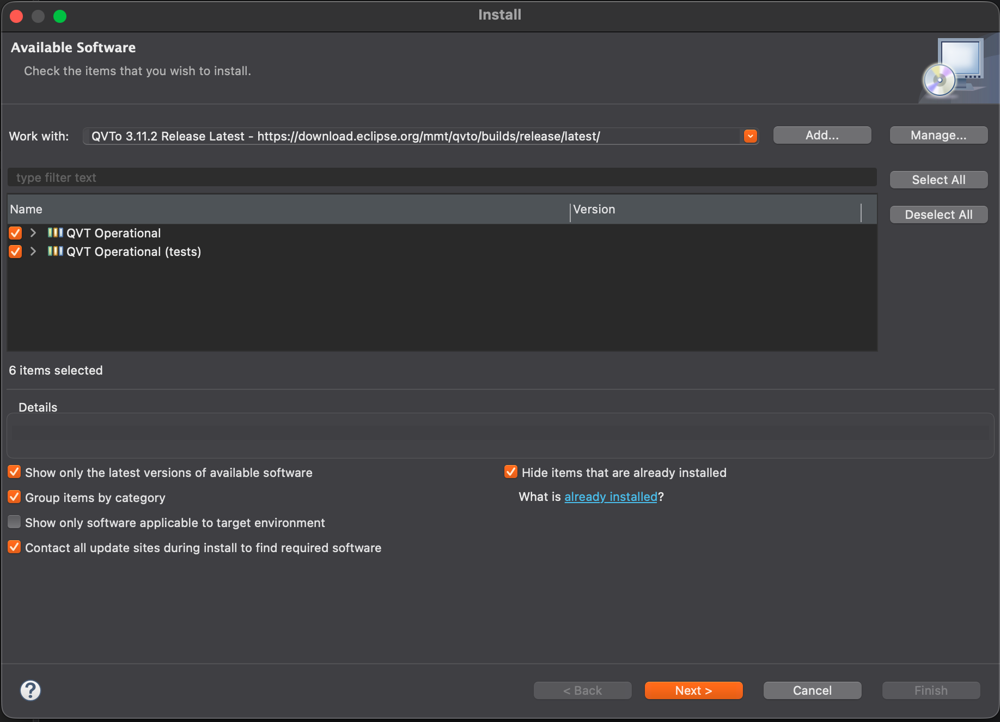
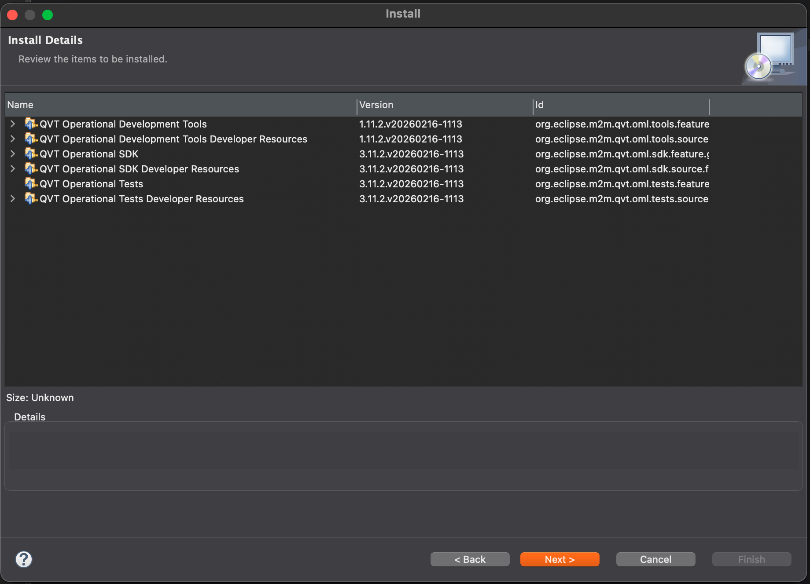
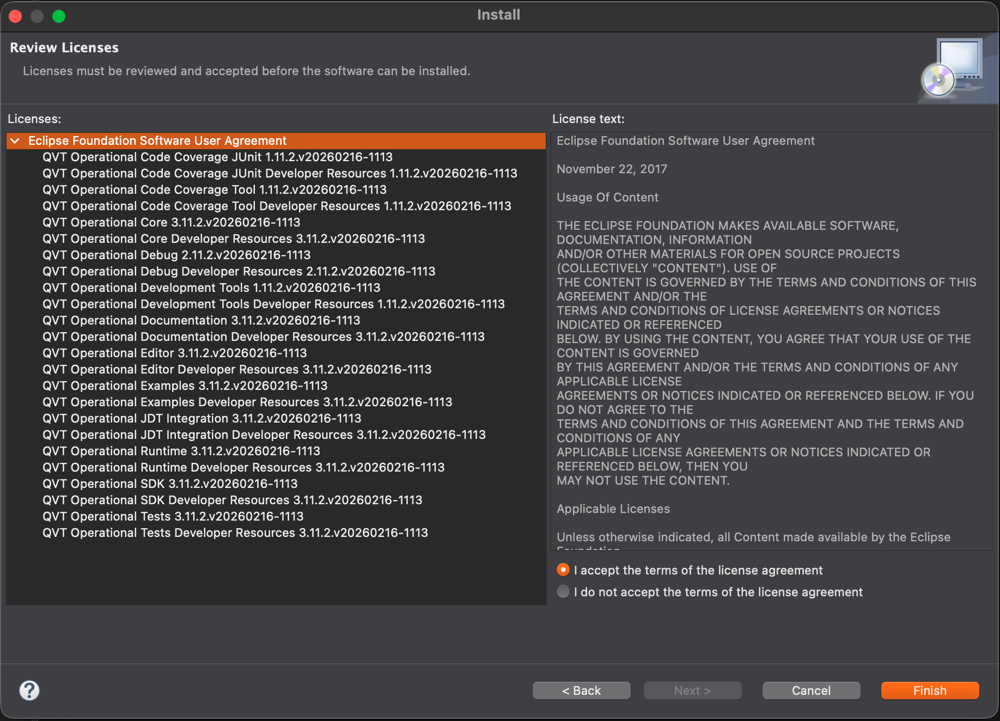

# QVT Operational – Manual Installation

> You can safely skip this guide if the last step, QVT Configuration, worked without errors, and you can run transformations.
>
> In some Eclipse installations, **QVT Operational (QVTo)** may not be available by default.
>
> If you do not see:
>
> **Run As → QVT Operational Transformation**
>
> or QVT-related options in Eclipse, you will need to install QVTo manually.


## Option 1 – Eclipse Marketplace

You can try installing QVTo via the Eclipse Marketplace:

Go to:

```text
Help → Eclipse Marketplace
```

{ width="300" }

Search for:

```text
QVT Operational
```

Click **Install** and follow the steps.

> In newer Eclipse versions, **QVTo may not appear in Marketplace**.  
> If it does not show, use the manual installation method below.

----------

## Option 2 – Install from Eclipse Update Site (Recommended)

This method installs QVTo directly from the Eclipse update site.  
You do **not** need to download the `.zip` file manually.

### Step 1 – Open Install New Software

Open Eclipse.

Go to:

```text
Help → Install New Software...

```

{ width="400" }

### Step 2 – Add the QVTo Update Site

Click **Add...**

In the **Add Repository** window, enter:

```text
Name: QVTo 3.11.2 Release Latest
Location: https://download.eclipse.org/mmt/qvto/builds/release/latest/

```

{ width="500" }

Click **Add**.

### Step 3 – Select Components

After Eclipse loads the available software, select:

-   **QVT Operational**
-   **QVT Operational (tests)**
    



Click:

```text
Next
```

### Step 4 – Review Install Details

Review the items to be installed.

You should see QVT Operational components such as:

-   QVT Operational Development Tools
    
-   QVT Operational SDK
    
-   QVT Operational Tests
    



Click:

```text
Next

```

### Step 5 – Accept the Licence

Select:

```text
I accept the terms of the license agreement

```



Click:

```text
Finish

```

### Step 6 – Restart Eclipse

After installation, Eclipse will ask you to restart.

Click:

```text
Restart Now
```

## Verification

After restarting Eclipse, verify that QVTo was installed correctly:

-   Right-click a `.qvto` file
-   Select:
    

```text
Run As → QVT Operational Transformation
```

If this option appears, QVTo is installed successfully.

## Alternative – Install from Downloaded Archive

If the direct update-site method does not work, you can still install QVTo from the archive manually.

Go to the official release page:

[https://download.eclipse.org/mmt/qvto/builds/release/latest/index.html](https://download.eclipse.org/mmt/qvto/builds/release/latest/index.html)

Download the `.zip` file, for example:

```text
QVTo-Updates-3.11.2.zip

```

Then in Eclipse:

```text
Help → Install New Software... → Add... → Archive...

```

Select the downloaded `.zip` file and continue with the same steps:

```text
Next → Next → Accept License → Finish
```

## Notes

-   Final tested version: **QVTo 3.11.2**
    
-   QVTo is still actively maintained, so newer versions may exist
    
-   Some Eclipse distributions already include QVTo
    
-   Use the direct update-site method first
    
-   Use the archive method only if the update-site method fails