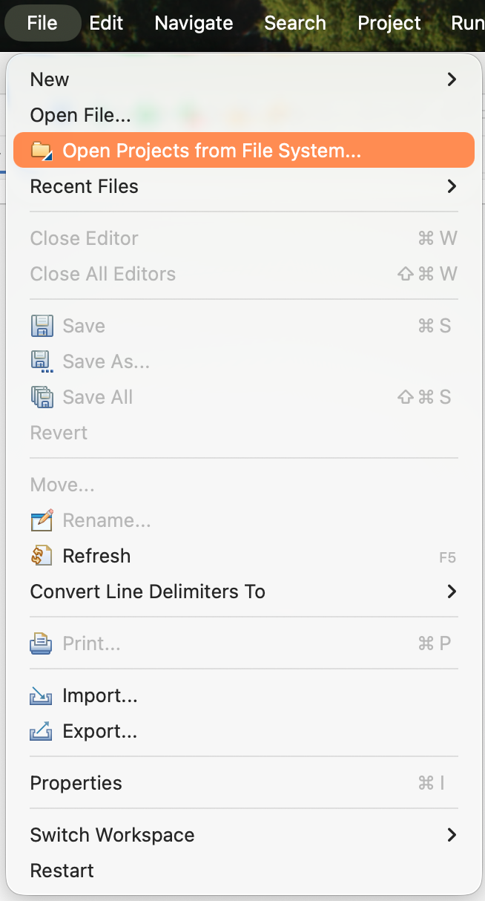
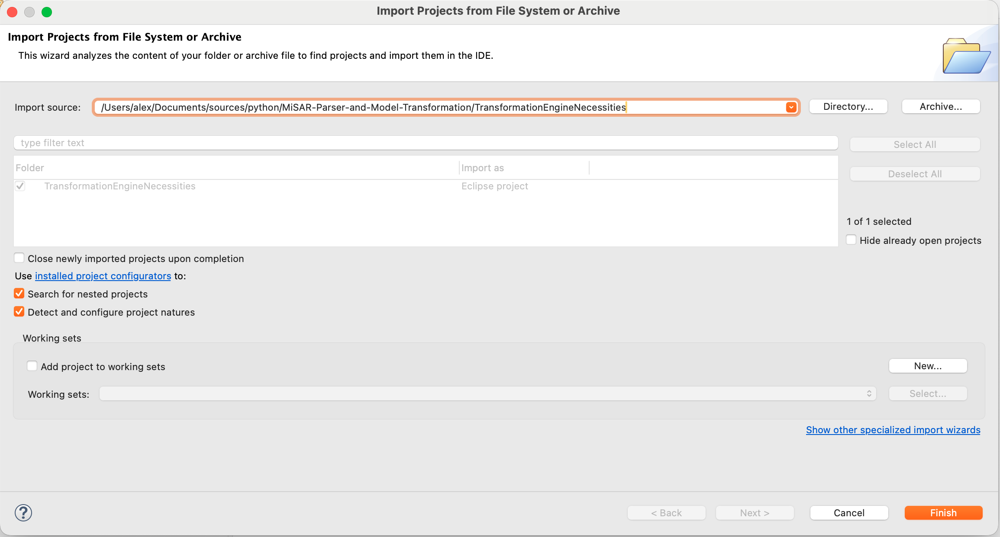
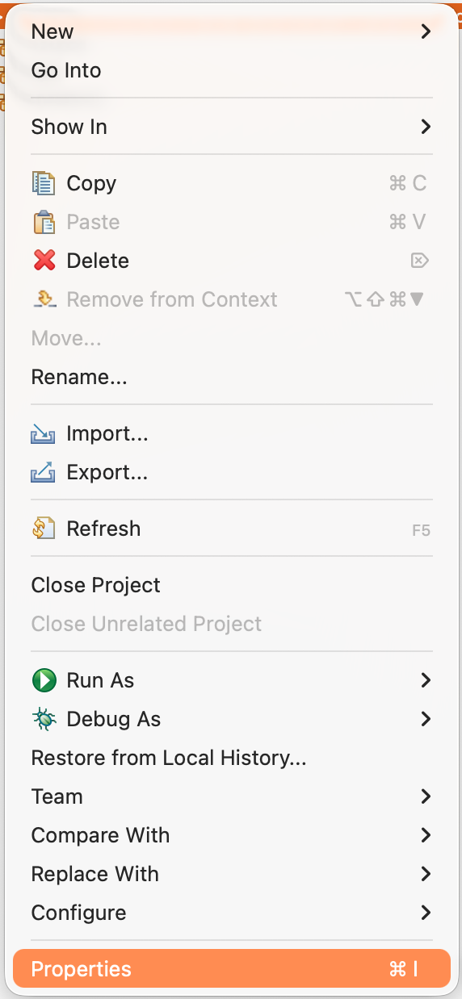
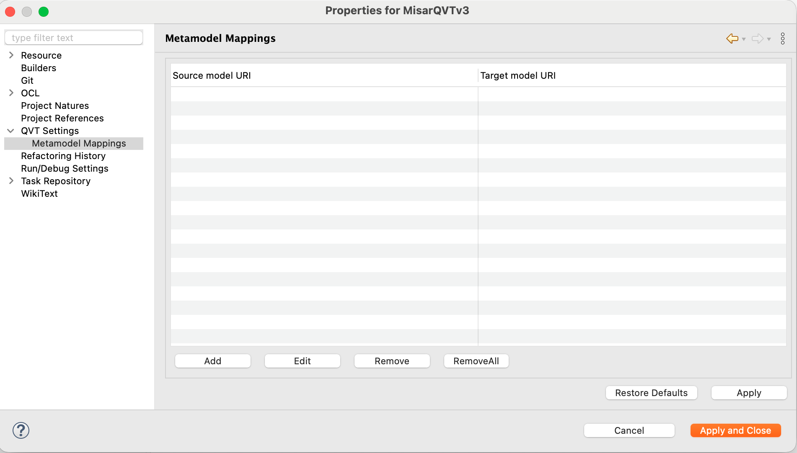
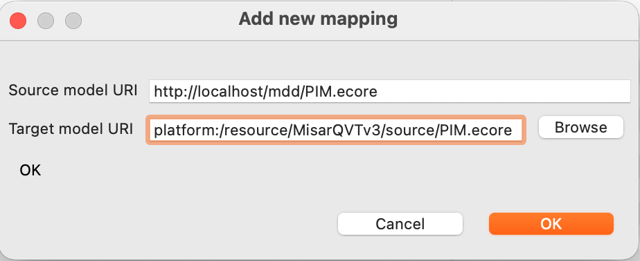
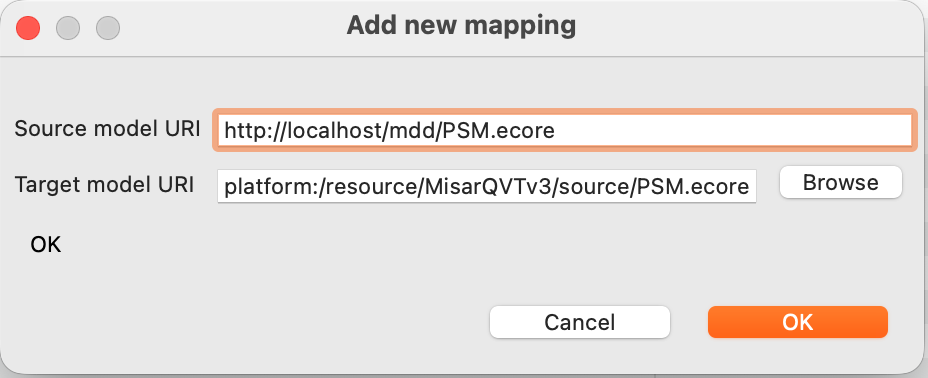

# QVT Setup (Eclipse)

> This guide is for setting up the QVT transformation engine in Eclipse. It is not required to run the MiSAR parser or generate PSM files, but it is necessary for transforming PSM to PIM.
> 
> The QVT transformation engine is used to transform the generated PSM into a PIM, which is the recovered architectural model of the microservice system.
> 
> If you don't see the QVT Settings in the project properties, it means that the QVT Operational component is not installed in your Eclipse environment. Please follow the manual installation steps described in this guide to install it [QVT Manual installation](qvt-manual-installation.md).

## Install Eclipse Modeling Tools
Download Eclipse Modeling Tools package. Latest version can be found at: [https://www.eclipse.org/downloads/packages/](https://www.eclipse.org/downloads/packages/)

## Import Project
File → Open Projects from File System

{ width="200" }

Select the `TransformationEngineNecessities` folder located in the MiSAR project directory:
MiSAR-Parser-and-Model-Transformation/TransformationEngineNecessities/

## Configure Metamodels
> In case you cannot find the QVT Settings in the project properties, make sure you have installed the QVT Operational component as described in the [manual installation guide](qvt-manual-installation.md).

Go to:
Project → Properties → QVT Settings → Metamodel Mappings

{ width="200" }

Add:

### PIM
| Source                         | Target                           |
|--------------------------------|----------------------------------|
| http://localhost/mdd/PIM.ecore | platform:/resource/.../PIM.ecore |

{ width="600" }

### PSM
| Source                         | Target                           |
|--------------------------------|----------------------------------|
| http://localhost/mdd/PSM.ecore | platform:/resource/.../PSM.ecore |

{ width="600" }

## Notes

- In some Eclipse installations, QVTo may already be included.

- If QVT Operational is not available in your Eclipse environment, please follow the manual installation steps described in this guide.

## Next Steps
If the Setup completes successfully, you can now run the QVT transformations to create the PIM from the generated PSM. [Create PIM Guide](create-pim.md)