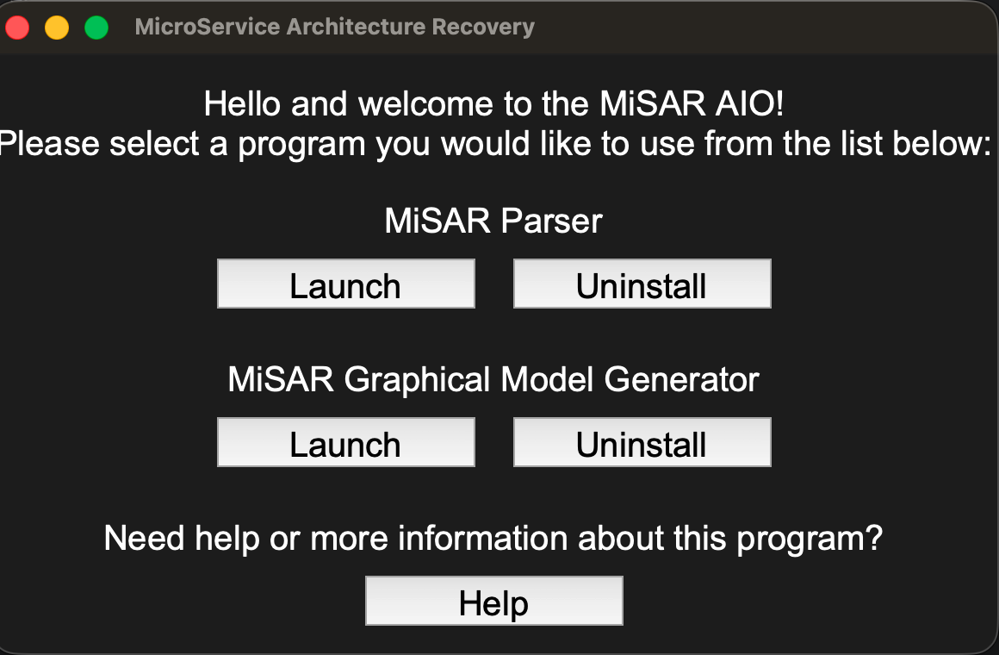
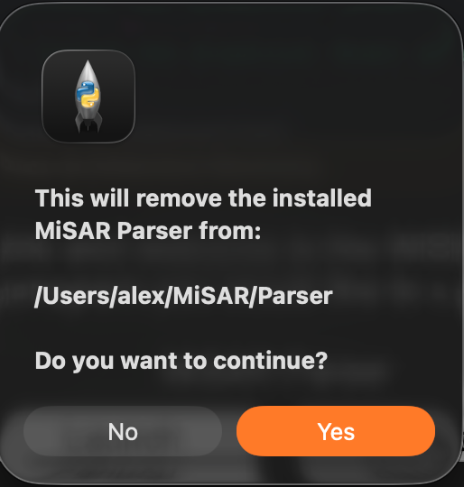
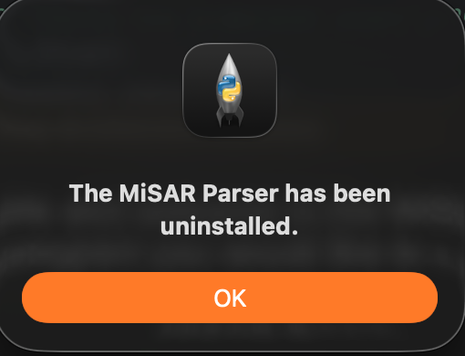

# Uninstallation

MiSAR AIO allows installed MiSAR modules to be removed directly from the interface.

This can be useful if a module needs to be reinstalled, reset, or removed from the local system.

## Uninstalling a MiSAR Module

To uninstall a MiSAR module:

1. Open MiSAR AIO:

```bash
python3 MiSAR.py
```

2.  Find the module you want to remove.
    
3.  Click the corresponding **Uninstall** button.
    

{ width="600" }

4.  A confirmation message will appear showing the installation directory that will be removed.
    

{ width="400" }

5.  Click **Yes** to continue.
    
6.  After the uninstall process finishes, a success message will appear.
    

{ width="400" }

## Verifying Uninstallation

MiSAR installs its modules inside the `MiSAR` folder in your home directory.

To verify whether a module has been removed, check the following location:

```text
HOME_DIR/MiSAR
```

For example, on macOS or Linux this may be:

```text
/Users/your-username/MiSAR
```

On Windows this may be:

```text
C:\Users\your-username\MiSAR
```

If the corresponding module folder has been removed, the uninstallation was successful.

## Notes

-   Uninstalling a module only removes the installed module files from the local `MiSAR` directory.
    
-   The main MiSAR AIO project folder is not removed.
    
-   If needed, the module can be installed again by launching it from MiSAR AIO.